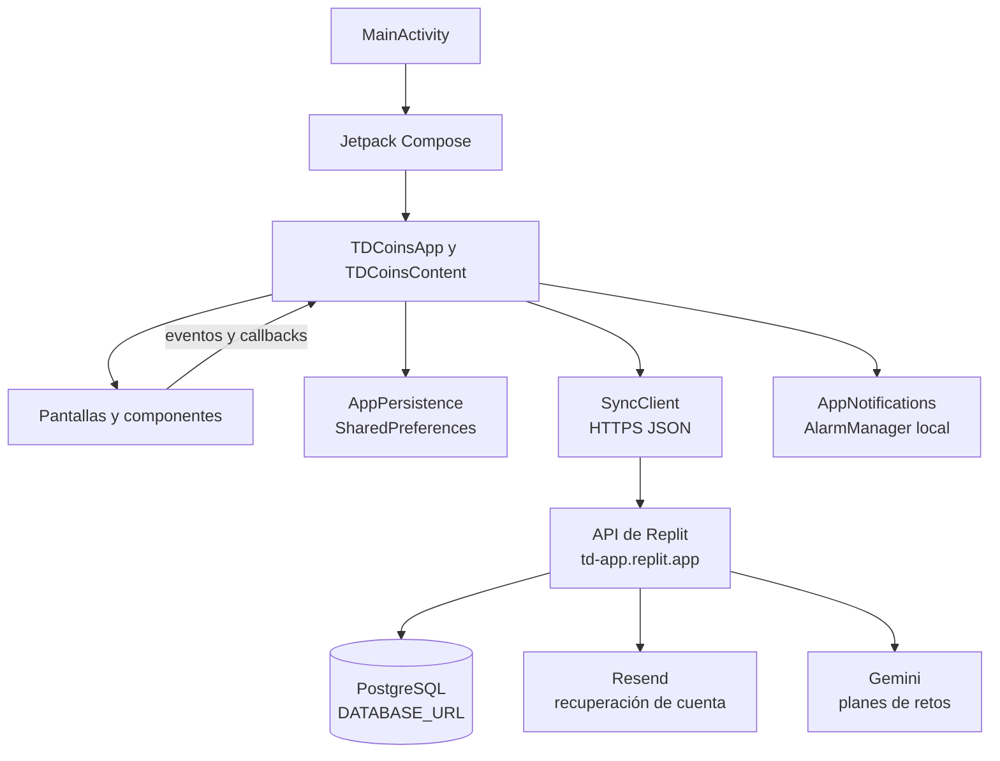

# TD-App: guía de arquitectura y presentación

Esta guía resume la implementación actual de TD-App para consulta personal y preparación de demostraciones con clientes. Describe el código Android y los servicios que usa; no sustituye una auditoría de seguridad ni una prueba de producción.

## Resumen rápido

TD-App es una aplicación Android nativa escrita en Kotlin. La interfaz está construida con Jetpack Compose. El progreso se conserva primero en el teléfono y, con una sesión y conexión disponibles, se sincroniza con la API de Replit y PostgreSQL.

La aplicación combina:

- Misiones con pasos, categorías, progreso y TD-Coins.
- Temporizador Pomodoro y seguimiento de rachas.
- Retos principales que pueden recibir un plan personalizado con IA.
- Dictado de voz o entrada manual de notas.
- Recordatorios locales de Android.
- Registro, inicio de sesión y recuperación de contraseña por correo.

La página `artifacts/td-coins-web` es la página web de presentación y descarga. **No renderiza las pantallas Android**: para revisar el flujo de misiones se usa la APK en un dispositivo o emulador.

## Mapa de arquitectura

`td-app.replit.app` es el dominio base configurado para llegar a la API. **El dominio no es la base de datos**: la API valida la sesión y trabaja con PostgreSQL mediante `DATABASE_URL`.

## Dónde se usa Jetpack Compose

### Código de producción

| Archivo | Uso de Compose |
|---|---|
| `app/src/main/java/com/tdcoins/app/MainActivity.kt` | Punto de entrada Android; llama a `setContent`, aplica el tema y procesa destinos de notificación. Incluye la pantalla animada de carga. |
| `app/src/main/java/com/tdcoins/app/App.kt` | Composición raíz. Controla la sesión, el estado global, la pestaña activa, la sincronización y la conexión entre pantallas mediante callbacks. |
| `app/src/main/java/com/tdcoins/app/Theme.kt` | Paleta, tipografía y tema Material 3. |
| `app/src/main/java/com/tdcoins/app/Components.kt` | Piezas visuales reutilizables: encabezado, navegación, tarjetas, etiquetas, saldo e iconos de interfaz. |
| `app/src/main/java/com/tdcoins/app/AppIcons.kt` | Iconos e ilustraciones dibujados o compuestos con Compose Canvas. |
| `app/src/main/java/com/tdcoins/app/AuthScreen.kt` | Formularios de acceso, registro y recuperación de contraseña. |
| `app/src/main/java/com/tdcoins/app/HomeScreen.kt` | Panel de inicio, resumen de progreso y accesos a secciones. |
| `app/src/main/java/com/tdcoins/app/MissionsScreen.kt` | Lista, creación, avance y finalización de misiones. También solicita feedback háptico al crear. |
| `app/src/main/java/com/tdcoins/app/VoiceScreen.kt` | Retos principales, notas, dictado, planes personalizados y confirmación de eliminación. La pantalla integra servicios Android para voz y permisos. |
| `app/src/main/java/com/tdcoins/app/PomodoroScreen.kt` | Interfaz del temporizador y sus controles; el estado del temporizador lo coordina `App.kt`. |
| `app/src/main/java/com/tdcoins/app/StoreScreen.kt` | Catálogo visual y confirmación de compras de recompensas internas. |
| `app/src/main/java/com/tdcoins/app/ReminderSettingsScreen.kt` | Interfaz para activar recordatorios, elegir hora, categorías y horas de silencio. |
| `app/src/main/java/com/tdcoins/app/Models.kt` | Modelos y lógica de combinación de snapshots. No es una pantalla, pero `MissionCategory` usa `androidx.compose.ui.graphics.Color`. |

### Pruebas que usan Compose

Los archivos de `app/src/androidTest/java/com/tdcoins/app/` usan las herramientas de pruebas UI de Compose:

- `MissionsScreenTest.kt`
- `MainChallengesScreenTest.kt`
- `MicrophonePermissionTest.kt`
- `AccessibilityAndLayoutTest.kt`
- `MainActivityFlowTest.kt`

### Cómo está organizada la interfaz

- Las funciones anotadas con `@Composable` describen las pantallas y sus piezas visuales.
- `remember` y `mutableStateOf` guardan estado de interfaz mientras vive la composición.
- `Modifier` compone tamaño, posición, interacción, accesibilidad y etiquetas de prueba.
- Las pantallas suelen recibir datos y emitir acciones mediante lambdas; `App.kt` procesa esos eventos y cambia el estado compartido.
- `LaunchedEffect` ejecuta trabajo asociado al ciclo de la composición, como guardar datos, sincronizar, temporizadores o enfriamientos.
- La navegación usa `AppTab` y estado en `App.kt`; no hay un `NavHost` de Navigation Compose ni una capa `ViewModel`.
- La navegación inferior se convierte en navegación lateral en ventanas anchas.

Archivos que **no** son pantallas Compose:

- `AppPersistence.kt`: serializa y restaura datos locales.
- `SyncClient.kt`: comunica la app con la API.
- `ProgressLogic.kt`: reglas de progreso y rachas.
- `AppData.kt`: datos iniciales.
- `AppNotifications.kt`: usa las API Android de notificaciones, preferencias y alarmas; no dibuja interfaz Compose.

## Estado, guardado local y sincronización

### Responsabilidades

| Parte | Responsabilidad |
|---|---|
| `TDCoinsContent` en `App.kt` | Mantiene el estado central: monedas, misiones, retos, Pomodoros terminados, racha, compras y notas. |
| Pantallas Compose | Muestran el estado y emiten acciones. No son el repositorio remoto. |
| `AppPersistence.kt` | Convierte `AppSnapshot` a JSON y lo guarda en `SharedPreferences` privado del dispositivo (`td_coins_state`). |
| `SyncClient.kt` | Envía solicitudes HTTP JSON y transforma respuestas en modelos de la app. |
| `artifacts/api-server/server/index.js` | API Node/Express: autenticación, sincronización, recuperación de cuenta y generación de planes. |
| PostgreSQL | Guarda cuentas, sesiones, códigos de recuperación y el snapshot sincronizado por cuenta. |

### Secuencia de sincronización

1. Al abrirse la app, `AppPersistence.load()` recupera el snapshot local.
2. Tras iniciar sesión, la app tiene un token de sesión y un identificador de usuario.
3. Cuando cambia el estado persistente, `App.kt` llama a `AppPersistence.save()`. El snapshot se serializa como JSON y se guarda con `SharedPreferences.apply()`.
4. Un efecto de `App.kt` llama a `SyncClient.sync()` inmediatamente y vuelve a intentarlo cada 10 segundos.
5. `SyncClient` envía `operationId`, `deviceId` y el snapshot a `POST /api/sync`, con el token en `Authorization: Bearer ...`.
6. El servidor autentica la petición, abre una transacción, bloquea el estado de esa cuenta, combina el snapshot y lo guarda en PostgreSQL.
7. La API devuelve el snapshot combinado. Android lo aplica y confirma la operación pendiente.
8. Si falla la conexión, la app conserva el estado local y muestra que hay cambios guardados sin conexión; vuelve a intentar en el siguiente ciclo.

La configuración de compilación está en `app/build.gradle.kts`. `SYNC_API_URL` permite cambiar la base; si no se define, el valor predeterminado actual es `https://td-app.replit.app`. Gradle lo incorpora como `BuildConfig.SYNC_API_URL`. `SyncClient` usa `HttpURLConnection`, JSON y tiempos máximos de conexión/lectura de 10 segundos. El manifiesto Android declara el permiso `INTERNET`.

### Rutas de API usadas por Android

| Ruta | Uso | Requiere sesión |
|---|---|---|
| `POST /api/auth/register` | Crear una cuenta | No |
| `POST /api/auth/login` | Iniciar sesión | No |
| `POST /api/auth/password-reset/request` | Solicitar un código por correo | No |
| `POST /api/auth/password-reset/confirm` | Validar el código y cambiar contraseña | No |
| `POST /api/sync` | Guardar/combinar el snapshot de la cuenta | Sí |
| `POST /api/challenges/plan` | Generar un plan para un reto | Sí |

### Qué se sincroniza y cómo se combinan cambios

El snapshot contiene monedas y eventos económicos, misiones, retos, notas de voz en texto, compras internas, racha, fechas y datos de Pomodoro. El servidor guarda el snapshot como JSONB en `sync_state`.

Para tolerar reintentos y cambios en más de un dispositivo:

- Cada operación tiene un UUID que queda pendiente hasta que el servidor confirma el guardado.
- `sync_operations` permite reconocer un reintento del mismo payload sin aplicarlo dos veces.
- Las operaciones de sincronización se procesan dentro de transacciones PostgreSQL.
- Las misiones y retos se combinan por identificador; el progreso y las fechas de actualización ayudan a elegir el estado más reciente.
- Los identificadores borrados se guardan como *tombstones* (`deletedMissionIds`, `deletedChallengeIds`, `deletedVoiceNoteIds`) para evitar que una sincronización restaure accidentalmente elementos eliminados.
- Los eventos de monedas se deduplican por ID; compras internas y listas de elementos se combinan según la lógica de `merge.js`.

Las reglas concretas viven en `app/src/main/java/com/tdcoins/app/Models.kt` y `artifacts/api-server/server/merge.js`. El esquema de PostgreSQL está en `artifacts/api-server/server/schema.sql`.

### Datos que no se sincronizan con la nube

- **Recordatorios:** se guardan por separado en `SharedPreferences` (`td_coins_reminders`) y se programan con `AlarmManager`. No forman parte de `AppSnapshot`, por lo que no se trasladan entre dispositivos.
- **Estado temporal del temporizador:** la cuenta de Pomodoros completados sí forma parte del snapshot, pero los controles temporales del temporizador no equivalen a un historial remoto.
- **Compras:** el catálogo y sus compras actuales son locales y se incluyen en el snapshot. No hay integración de pago, validación de recibos, inventario ni entrega a cliente.
- **Audio:** la app conserva texto de notas, no un historial de grabaciones de audio.

El bucle de sincronización está ligado a la composición de la app; no es una tarea Android garantizada en segundo plano como `WorkManager`. La API de sincronización tampoco es un historial completo de cada campo: el estado principal es un snapshot por cuenta, más el registro de operaciones para deduplicar.

## Autenticación y base de datos

El servidor recibe `DATABASE_URL` y `SESSION_SECRET` desde la configuración segura del entorno; sus valores no forman parte de la APK.

- El registro valida correo y una contraseña de al menos ocho caracteres.
- Las contraseñas se procesan con `scrypt` y salt; no se guardan como texto plano.
- Al iniciar sesión, la API devuelve un token aleatorio. La base guarda un HMAC del token y su fecha de expiración, no el token original.
- Las rutas protegidas validan el token Bearer y su expiración.
- Las sesiones vencen a los 30 días; no hay flujo de refresh token implementado.
- El cierre de sesión Android elimina el token local, pero actualmente no llama a la ruta de revocación del servidor; esa sesión remota puede seguir válida hasta vencer o hasta que se cambie la contraseña.
- `AppPersistence` guarda el token en `SharedPreferences` `MODE_PRIVATE`; esto no es lo mismo que almacenamiento cifrado.

Tablas principales:

| Tabla | Contenido |
|---|---|
| `sync_users` | Cuenta, correo y hash de contraseña. |
| `sync_sessions` | Hash de token y vencimiento de la sesión. |
| `password_reset_codes` | Hash del código, cuenta asociada, vencimiento y uso. |
| `password_reset_limits` | Límites de solicitudes de recuperación. |
| `sync_state` | Snapshot JSONB y revisión por cuenta. |
| `sync_operations` | Operaciones recibidas para idempotencia y revisiones aplicadas. |

## Resend: recuperación de contraseña por correo

Resend se usa para **correo transaccional de recuperación de cuenta**, no para campañas de marketing ni para la sincronización de progreso.

Flujo:

1. En `AuthScreen.kt`, la persona escribe su correo y pide recuperar la contraseña.
2. `SyncClient.kt` llama a `POST /api/auth/password-reset/request`.
3. La API devuelve un mensaje genérico tanto si la cuenta existe como si no, para no revelar qué correos están registrados.
4. Si corresponde, el servidor crea un código aleatorio de un solo uso. Guarda su HMAC, no el código en claro; el código caduca en 15 minutos.
5. `sendPasswordResetEmail()` construye el mensaje HTML y texto, y Resend lo entrega al correo.
6. La persona introduce el código y su nueva contraseña en TD-App.
7. El servidor verifica que el código exista, no haya caducado ni se haya usado; actualiza el hash de contraseña y revoca las sesiones anteriores.

### Cómo sale el correo

`artifacts/api-server/server/index.js` usa una de dos rutas:

- Si existe el secreto `RESEND_API_KEY` en el entorno del servidor, el backend hace una petición HTTPS a `https://api.resend.com/emails`.
- Si no existe esa variable, el código intenta enviar mediante el conector de Replit `resend`.

El secreto se configura en el entorno seguro de Replit; nunca debe incorporarse en Kotlin, la APK, el sitio web o este documento. `PASSWORD_RESET_FROM` permite configurar el remitente y `PASSWORD_RESET_APP_URL` la URL usada para construir la dirección del logotipo del correo. La pantalla de TD-App pide ingresar el código; el correo no es un enlace de acceso automático.

### Límites y punto a validar antes de una demostración comercial

- El servidor limita las solicitudes a tres por cuenta y veinte por IP en una ventana de 15 minutos. La pantalla muestra un enfriamiento de 30 segundos, que no reemplaza esos límites del backend.
- Si Resend falla, el servidor registra el error pero mantiene la respuesta genérica `202`; la interfaz podría indicar que se envió aunque el proveedor no lo haya entregado. Conviene validar entrega real durante pruebas.
- El remitente de reserva del código es `TD-Coins <onboarding@resend.dev>`. Para una experiencia con marca propia y envío a destinatarios reales, hay que configurar y verificar un remitente/dominio apropiado con el proveedor.

## Retos personalizados con IA

Cuando la persona solicita un plan, Android envía el texto del reto —no el audio original— a `POST /api/challenges/plan`. La API requiere una sesión, acepta texto de 3 a 500 caracteres y necesita `GEMINI_API_KEY` en el entorno del servidor. El plan generado contiene tres recordatorios y cuatro pasos de acción en español.

Si la generación remota falla, `VoiceScreen.kt` crea un plan provisional local para que la persona pueda continuar. El resultado se guarda en el estado local y entra en la siguiente sincronización; la llamada de generación en sí no crea un registro independiente en la base. La función es de organización y apoyo: no diagnostica ni sustituye atención profesional.

## Recordatorios, voz y notificaciones

- `AppNotifications.kt` usa preferencias locales y `AlarmManager` para programar recordatorios; respeta los periodos de silencio configurados y vuelve a programarlos ante ciertos eventos del dispositivo.
- Tocar una notificación lleva a la pestaña indicada mediante un extra de `MainActivity`.
- Android 13 o posterior puede pedir permiso para notificaciones. Android puede retrasar alarmas según sus políticas de batería; la entrega exacta no se debe prometer sin pruebas en dispositivos representativos.
- El dictado usa el servicio `SpeechRecognizer` disponible en Android. Si no hay servicio, permiso o conexión, se puede escribir la nota manualmente. El funcionamiento sin conexión depende del servicio de reconocimiento del teléfono.
- El texto de un reto se envía al servidor si se pide generar un plan con IA.

## Cómo contar la idea al cliente

### Propuesta breve

> TD-App ayuda a convertir una meta grande en un siguiente paso claro. La persona define una misión medible, trabaja en bloques de concentración, recibe recordatorios y puede ver su avance en rachas y TD-Coins. Si describe un reto, la app puede proponer un plan breve para empezar. El progreso se conserva en el teléfono y, con una cuenta y conexión, se sincroniza para dar continuidad.

### Valor que se puede demostrar

1. **Menos fricción para empezar:** una intención se convierte en una misión con meta y pasos concretos.
2. **Progreso visible:** Pomodoros, avance de misiones, rachas y TD-Coins ofrecen señales simples de continuidad.
3. **Apoyo contextual:** notas por voz o texto, recordatorios y planes de acción ayudan a adaptar el siguiente paso a la necesidad del usuario.
4. **Continuidad de cuenta:** el snapshot se sincroniza con el backend cuando hay sesión y conexión.
5. **Experiencia nativa:** accesibilidad Android, notificaciones locales y feedback háptico forman parte del flujo móvil.

### Guion de demostración sugerido

1. Crear/iniciar una cuenta y mostrar recuperación de contraseña.
2. Crear una misión pequeña, seleccionar categoría y capturar manualmente la meta de pasos.
3. Iniciar un bloque Pomodoro y mostrar cómo se registra al completarlo.
4. Avanzar una misión y enseñar el progreso/TD-Coins.
5. Describir un reto principal y mostrar los recordatorios y pasos que genera el plan.
6. Explicar que el progreso se guarda localmente y se sincroniza al recuperar conexión.

### Qué conviene explicar con precisión

- TD-App es una herramienta de organización y acompañamiento; no se debe vender como diagnóstico, terapia o cura para el TDAH.
- Los recordatorios son locales y el sistema operativo puede retrasarlos.
- El catálogo de TD-Coins es actualmente interno/local; no procesa pagos ni garantiza envío de productos.
- No se debe prometer dictado sin conexión para todos los teléfonos.
- La sincronización remota requiere cuenta, conexión y que el backend esté disponible.
- La recuperación por correo depende de un remitente verificado y de la entrega de Resend.

### Oportunidades antes de una oferta de producción

- Probar sincronización, restablecimiento de contraseña, dictado, accesibilidad y alarmas en una matriz de dispositivos Android.
- Decidir si recordatorios y temporizador deben sincronizarse entre dispositivos.
- Si las TD-Coins se canjearán por bienes reales, agregar backend para validar saldos, compras, inventario y entrega; la lógica local actual no basta.
- Definir políticas de privacidad, retención, exportación/borrado de cuenta y soporte.
- Validar el remitente del correo y los límites/costos de los servicios externos antes de un piloto amplio.

## Archivos clave para volver al código

- Android/UI: `app/src/main/java/com/tdcoins/app/`
- Estado y persistencia local: `App.kt`, `Models.kt`, `AppPersistence.kt`
- Red y endpoints: `SyncClient.kt`, `app/build.gradle.kts`
- Recordatorios Android: `AppNotifications.kt`, `ReminderSettingsScreen.kt`
- API, autenticación, Resend y Gemini: `artifacts/api-server/server/index.js`
- Reglas de combinación: `artifacts/api-server/server/merge.js` y `Models.kt`
- Esquema PostgreSQL: `artifacts/api-server/server/schema.sql`
- Pruebas Android UI: `app/src/androidTest/java/com/tdcoins/app/`
- Sitio de presentación/descarga: `artifacts/td-coins-web/`